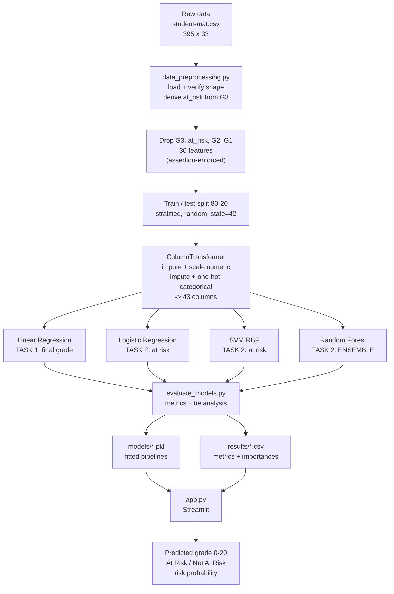
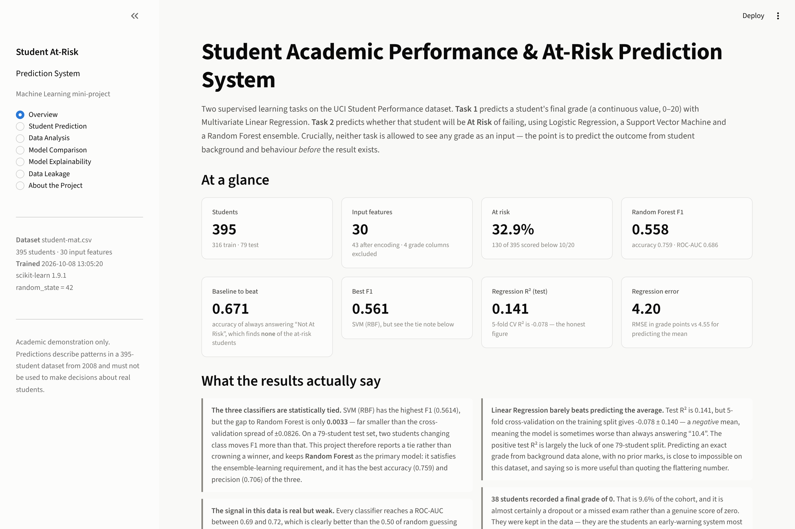
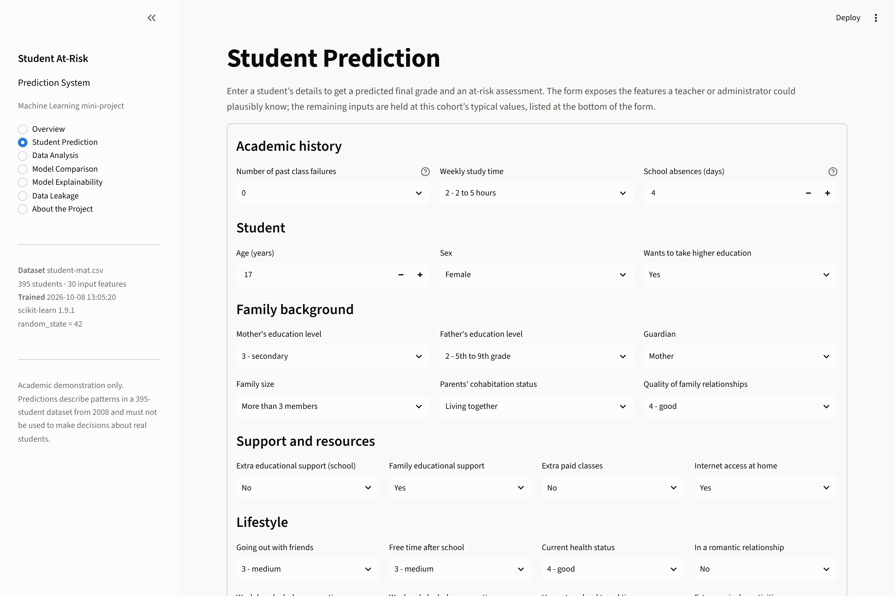
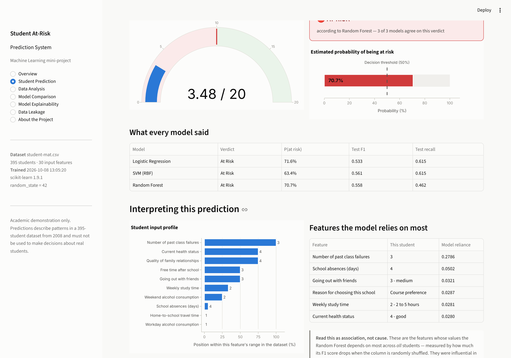
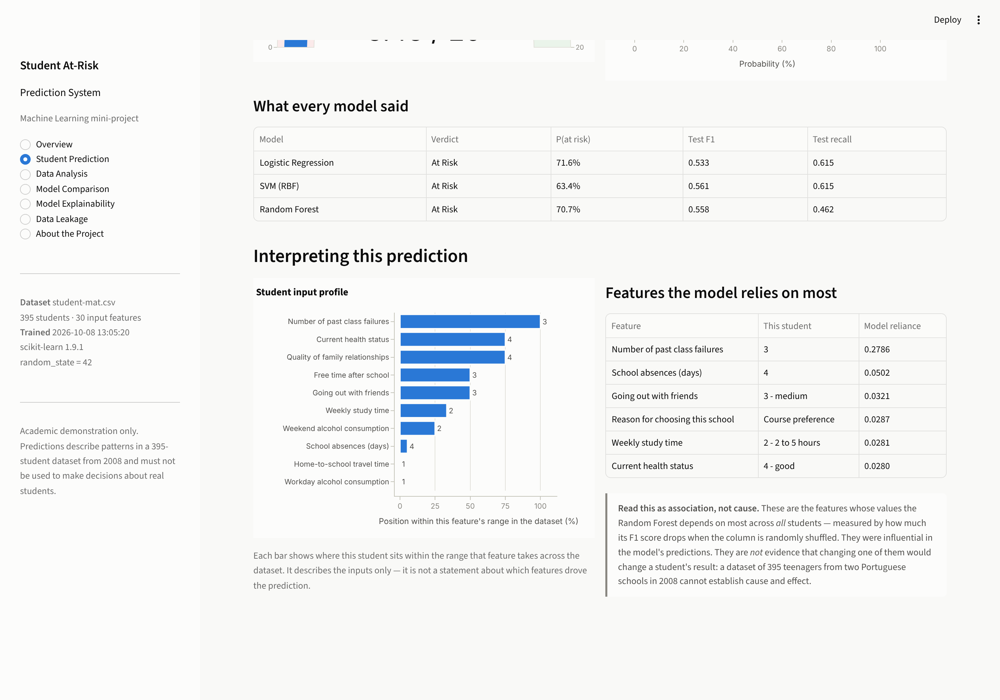
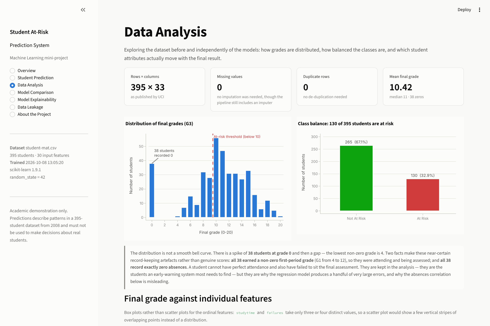
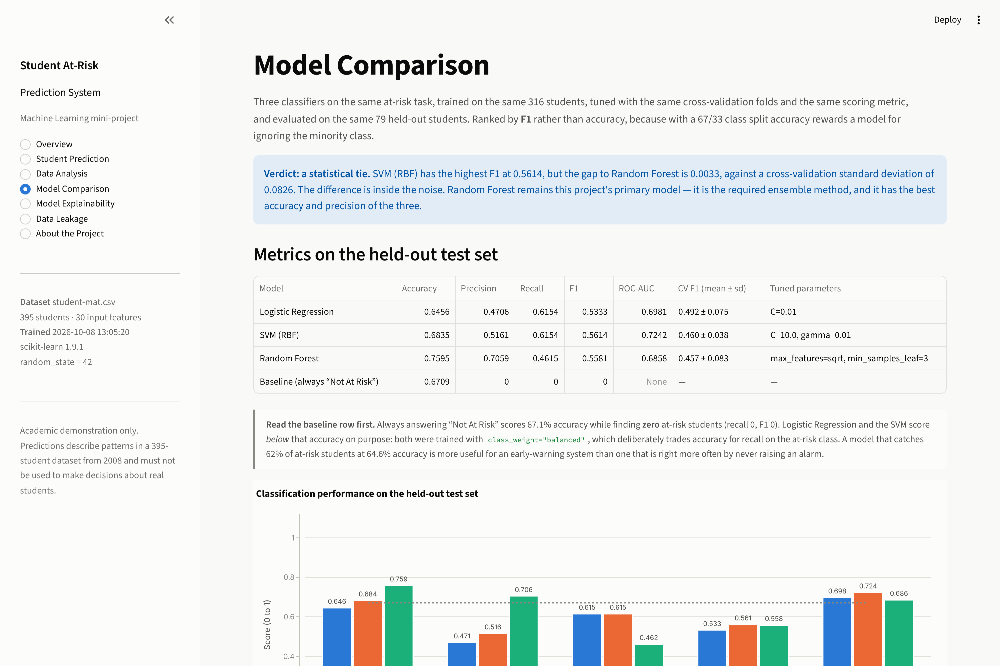
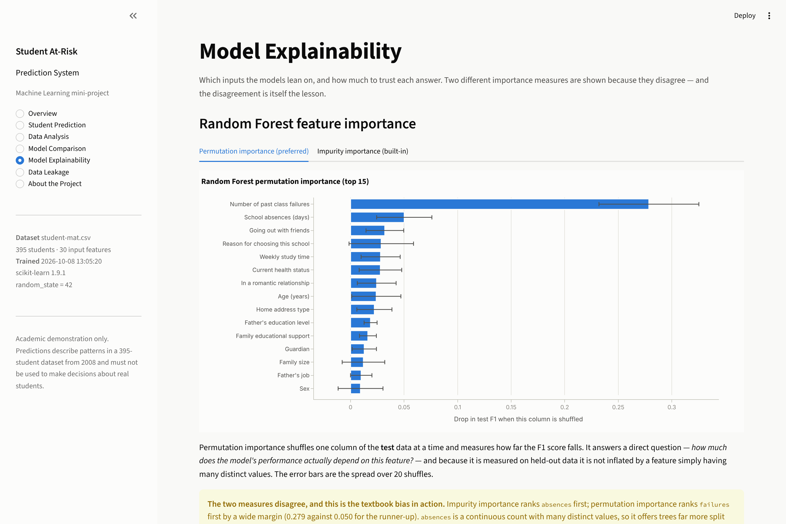
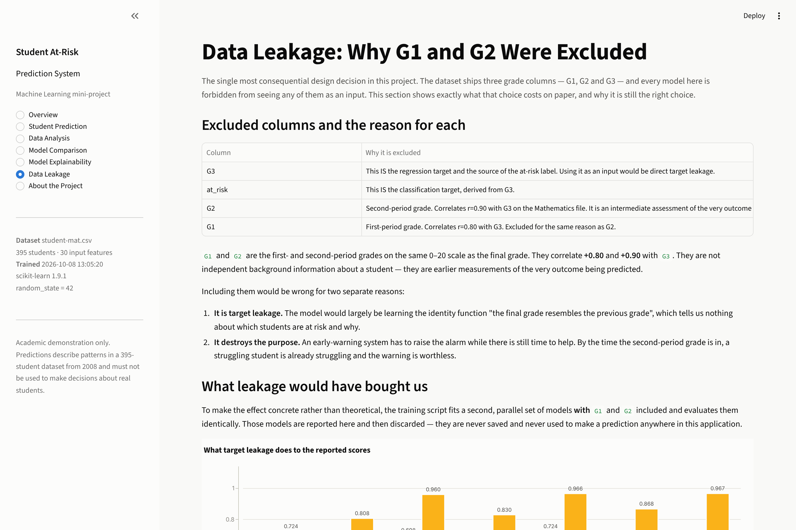

# Student Academic Performance & At-Risk Prediction System

A Machine Learning mini-project that predicts a secondary-school student's final
grade and flags students at risk of failing, using the **UCI Student Performance**
dataset. Four algorithms are implemented and compared — Multivariate Linear
Regression, Logistic Regression, a Support Vector Machine, and a Random Forest
ensemble — behind an interactive Streamlit application.

> **Every number in this README came out of a trained model.** They are
> reproduced from `results/model_results.csv`, which is written by
> `src/train_models.py`. Nothing is estimated, rounded up, or copied from
> another project. Some of the figures are modest; the reasons are explained
> rather than hidden, and [one section](#11-the-most-important-result-what-data-leakage-would-have-bought-us)
> shows exactly how much better they could have been made to look by cheating.

---

## Table of contents

1. [Problem statement](#1-problem-statement)
2. [Objectives](#2-objectives)
3. [Dataset](#3-dataset)
4. [Features](#4-features)
5. [Target variables](#5-target-variables)
6. [Data preprocessing](#6-data-preprocessing)
7. [Algorithms used, and why](#7-algorithms-used-and-why)
8. [Ensemble learning explained](#8-ensemble-learning-explained)
9. [Training methodology](#9-training-methodology)
10. [Evaluation metrics](#10-evaluation-metrics)
11. [The most important result: what data leakage would have bought us](#11-the-most-important-result-what-data-leakage-would-have-bought-us)
12. [Results](#12-results)
13. [Robustness check on the second subject file](#13-robustness-check-on-the-second-subject-file)
14. [Model comparison](#14-model-comparison)
15. [Feature importance](#15-feature-importance)
16. [System architecture](#16-system-architecture)
17. [Screenshots](#17-screenshots)
18. [Installation](#18-installation)
19. [How to run](#19-how-to-run)
20. [Project structure](#20-project-structure)
21. [Limitations](#21-limitations)
22. [Future scope](#22-future-scope)
23. [Ethical statement](#23-ethical-statement)
24. [Conclusion](#24-conclusion)
25. [References](#25-references)
---

## 1. Problem statement

Academic failure is easy to diagnose in hindsight and expensive to reverse. By
the time a final grade is published, the opportunity to intervene has passed.

The question this project asks is whether failure can be **anticipated**: given
the information a school already holds about a student — family background,
study habits, support received, past failures, lifestyle — can a model identify,
*before the final assessment exists*, who is likely to fall below the pass mark?

That framing is what makes the project non-trivial, and it drives the single
most important design decision in it: **no model here is allowed to see any
grade as an input.** The dataset ships three grade columns (`G1`, `G2`, `G3`) and
all three are excluded from the feature matrix. Section 11 shows what that
costs, and why it is still correct.

## 2. Objectives

1. Predict a student's **final academic score** (continuous, 0–20) with
   Multivariate Linear Regression.
2. Classify a student as **At Risk** or **Not At Risk** of failing.
3. Compare three classification algorithms on identical data, splits, folds and
   scoring, and report whether the differences between them are real.
4. Identify which student attributes the models rely on, using two independent
   importance measures.
5. Present all of it through a clear, interactive web application suitable for a
   live demonstration.
6. Do all of the above **without target leakage**, and quantify the effect of
   the leakage that was avoided.

## 3. Dataset

**UCI Student Performance** (Cortez & Silva, 2008) — real records from two
Portuguese secondary schools, gathered from school reports and student
questionnaires.

| | |
|---|---|
| Source | [UCI Machine Learning Repository, dataset 320](https://archive.ics.uci.edu/dataset/320/student+performance) (DOI 10.24432/C5TG7T) |
| File used | `data/raw/student-mat.csv` (Mathematics) |
| Shape | **395 students × 33 attributes** |
| Missing values | **0** |
| Duplicate rows | **0** |
| Final grade `G3` | mean **10.42**, median **11**, range 0–20 |
| Students with `G3` = 0 | **38** (9.6%) |
| At risk (`G3` < 10) | **130** (32.9%) |

Both published files are committed under `data/raw/`, so the project runs
without a download. The loader **verifies the file against the shape UCI
documents** and refuses to train if it does not match — a guard against
silently training on a truncated or substituted download.

### Why the Mathematics file only

The companion Portuguese-language file (649 students) is also committed, and
`src/train_models.py --dataset por` will train on it. The two files are
deliberately **not concatenated**: 382 students appear in *both*, so stacking
them would place the same student in the training set and the test set. That is
itself a form of leakage, and it would quietly inflate every score in this
README.

### Three things the data inspection turned up

These were found before any model was written, and each one changed a decision:

1. **38 students recorded a final grade of exactly 0**, with a gap before the
   next grade (the lowest non-zero grade is 4). Two facts make these near-certain
   data artefacts rather than genuine scores: **all 38 earned a non-zero
   first-period grade** (`G1` between 4 and 12), so they were attending and being
   assessed; and **all 38 record exactly 0 absences**. A student cannot
   simultaneously have perfect attendance and have failed to sit the final
   assessment. **They were kept** — they are precisely the students an
   early-warning system exists to find — but they produce the spike at zero in
   the grade histogram, a cluster of very large regression residuals, and the
   masked correlation in finding (2). Dropping 10% of the data to improve R²
   would have been cherry-picking.
2. **The headline `absences` correlation is misleading, and the reason is
   finding (1).** Across all 395 students, `absences` correlates with the final
   grade at just **r = +0.034** — in practice, nothing. But **all 38 zero-grade
   students record exactly 0 absences**, and removing them flips the correlation
   to **r = −0.213**. So absences *do* relate negatively to attainment among
   students with a real recorded grade; the artefact group was masking it. Both
   numbers are reported, because quoting the raw +0.034 alone would be wrong.
3. **The majority-class baseline scores 67.1% accuracy.** Always answering "Not
   At Risk" is right about two times in three while finding *zero* at-risk
   students. Any accuracy figure in this project has to be read against that
   number, which is why the comparison is ranked by F1 instead.

## 4. Features

**30 input features** (13 numeric, 17 categorical), becoming **43 columns** after
encoding.

<details>
<summary><b>Numeric features (13)</b></summary>

| Feature | Meaning | Range |
|---|---|---|
| `age` | student's age | 15–22 |
| `Medu` | mother's education | 0–4 (ordinal) |
| `Fedu` | father's education | 0–4 (ordinal) |
| `traveltime` | home-to-school travel time | 1–4 (ordinal) |
| `studytime` | weekly study time | 1–4 (ordinal) |
| `failures` | past class failures | 0–3 |
| `famrel` | quality of family relationships | 1–5 (ordinal) |
| `freetime` | free time after school | 1–5 (ordinal) |
| `goout` | going out with friends | 1–5 (ordinal) |
| `Dalc` | workday alcohol consumption | 1–5 (ordinal) |
| `Walc` | weekend alcohol consumption | 1–5 (ordinal) |
| `health` | current health status | 1–5 (ordinal) |
| `absences` | school absences | 0–75 |

The Likert-style columns are **ordered** scales, so they are treated as numeric
rather than one-hot encoded. This keeps the model small and the coefficients
interpretable, at the cost of assuming the steps are evenly spaced — a standard
and defensible simplification, stated here because an examiner may well ask.

</details>

<details>
<summary><b>Categorical features (17)</b></summary>

`school`, `sex`, `address`, `famsize`, `Pstatus`, `Mjob`, `Fjob`, `reason`,
`guardian`, `schoolsup`, `famsup`, `paid`, `activities`, `nursery`, `higher`,
`internet`, `romantic`

</details>

### Excluded columns, and the reason for each

| Column | Why it is excluded |
|---|---|
| `G3` | **This is the regression target** and the source of the at-risk label. Using it as an input would be direct target leakage. |
| `at_risk` | **This is the classification target**, derived from `G3`. |
| `G2` | Second-period grade. Correlates **r = +0.90** with `G3`. It is an intermediate measurement of the very outcome being predicted, so it both leaks the target and destroys the early-warning use case — a grade this late leaves no time to act. |
| `G1` | First-period grade. Correlates **r = +0.80** with `G3`. Excluded for the same reason. |

The exclusion is enforced in code, not just by convention:
`split_features_target()` in `src/data_preprocessing.py` raises an
`AssertionError` if any forbidden column reaches the feature matrix, so the
training run fails loudly rather than producing a quietly inflated score.

## 5. Target variables

**Regression target** — `G3`, the final grade, a continuous value from 0 to 20.

**Classification target** — `at_risk`, derived as:

```
at_risk = 1  if G3 < 10     (At Risk)
at_risk = 0  if G3 >= 10    (Not At Risk)
```

**Why 10?** On the Portuguese 0–20 grading scale, 10 is the pass mark, so the
threshold is the domain's own definition of failure rather than an arbitrary cut
chosen to balance the classes. The resulting split was checked on the actual
data before being adopted: it gives **130 at risk (32.9%)** against **265 not at
risk (67.1%)** — imbalanced enough to make accuracy misleading, balanced enough
that the minority class is learnable.

Neither target is ever an input feature, and `G3` is removed from the feature
matrix for *both* tasks.

## 6. Data preprocessing

All preprocessing lives in a single scikit-learn `ColumnTransformer`, which is
nested **inside each model's `Pipeline`**:

```
Numeric branch      SimpleImputer(median)        ->  StandardScaler()
Categorical branch  SimpleImputer(most_frequent) ->  OneHotEncoder(drop="if_binary",
                                                                   handle_unknown="ignore")
```

Four decisions worth defending in a viva:

- **The preprocessor sits inside the Pipeline, which is what prevents leakage.**
  When `pipeline.fit(X_train, y_train)` runs, the scaler's mean and standard
  deviation and the encoder's category list are computed from training rows
  *only*. The test set never influences them. Fitting a scaler on the full
  dataset before splitting is the single most common leakage mistake in student
  ML projects, and the pipeline structure makes it impossible here.
- **Imputers are included even though this dataset has zero missing values.**
  They cost nothing and they mean the saved pipeline cannot crash on a
  real-world form submission with a blank field.
- **Scaling is essential for two of the three classifiers.** Logistic Regression
  penalises coefficient magnitude and the SVM's RBF kernel uses squared
  Euclidean distances. Without scaling, `absences` (range 0–75) would dominate
  `studytime` (range 1–4) purely because of its units. Random Forest does not
  need scaling — it splits on thresholds, so any monotonic rescaling leaves its
  trees unchanged — but it shares the same preprocessor so that exactly one
  preprocessing definition has to be explained and audited.
- **`drop="if_binary"`** gives one column per yes/no feature instead of two
  redundant collinear ones, which keeps the Logistic Regression coefficients
  readable. **`handle_unknown="ignore"`** means a category the model never saw
  is encoded as all-zeros rather than raising — important for the web form,
  where a user can submit anything. The application detects and reports this
  case instead of failing.

The **same fitted pipeline object** is saved with `joblib` and loaded by the app,
so a form submission is transformed by byte-identical preprocessing to training.

## 7. Algorithms used, and why

| Model | Task | Why it is in the project |
|---|---|---|
| **Multivariate Linear Regression** | predict `G3` | The baseline for a continuous target: many inputs, one numeric output, fitted by least squares. Coefficients are directly readable, and — as it turns out — its *failure* on this data is the more instructive result. |
| **Logistic Regression** | at-risk classification | The linear baseline for classification. Produces a genuine probability through the sigmoid function, and its signed coefficients show the direction of each association. |
| **Support Vector Machine (RBF)** | at-risk classification | Tests whether a **non-linear** decision boundary helps. The RBF kernel can curve the boundary in ways a linear model cannot, which is the direct comparison against Logistic Regression. |
| **Random Forest** | at-risk classification | The required **ensemble** method, and this project's primary model. Also supplies the feature-importance analysis. |

**Why exactly these four and nothing more.** Each answers a distinct question: is
the target continuous or categorical; is the boundary linear or curved; is one
model better than many. A neural network on 316 training rows would add
parameters, training time and explanation cost while almost certainly
overfitting. Gradient boosting was considered and left out: Random Forest
already satisfies the ensemble requirement, and given that the three models here
turn out to be *statistically tied* (section 13), a fourth would add a row to a
table and no insight. The project stops deliberately.

**Only one regression model is reported**, and that is intentional. The
regression half exists to demonstrate Multivariate Linear Regression. Adding
Ridge, Lasso or a regression tree purely to populate a comparison table would
demonstrate nothing the classification comparison does not already show. The
reference point that *does* matter is included: the baseline that always
predicts the training mean.

## 8. Ensemble learning explained

```
Individual Decision Tree  →  Multiple Trees  →  Bagging  →  Random Forest  →  Final Prediction
```

**Ensemble learning** means combining several models so the group performs better
than any individual member. It works on one condition: the members must make
**different** mistakes. If every model errs identically, averaging them changes
nothing.

**Bagging** (**B**ootstrap **AGG**regat**ING**) is one way to manufacture that
difference. From the 316 training students, draw many random samples *with
replacement*, each the same size as the original. Each bootstrap sample omits
roughly a third of the students and duplicates others, so every tree is fitted
to a slightly different world and learns slightly different rules.

**A Random Forest is bagging plus one extra idea.** Each tree is grown on its own
bootstrap sample **and** is restricted, at every split, to a random subset of the
features (here `max_features="sqrt"`, so about 6 of 43 encoded features per
split). Without that restriction every tree would seize on `failures` as its
first split and the trees would end up near-identical — the averaging would buy
almost nothing. The feature restriction is what forces them apart.

**Why a Random Forest is an ensemble and a single decision tree is not.** One
tree fitted to 316 students can keep splitting until nearly every leaf holds a
single student: it memorises the data. This project's forest trains **400** such
trees and takes a majority vote, so the individual over-fitting largely cancels.

That effect is visible in this project's own numbers rather than asserted:

| | train F1 | test F1 | gap |
|---|---|---|---|
| Logistic Regression | 0.5498 | 0.5333 | **+0.0164** |
| SVM (RBF) | 0.7719 | 0.5614 | **+0.2105** |
| Random Forest | 0.9763 | 0.5581 | **+0.4182** |

The Random Forest still shows a train-to-test gap of **+0.42** *even with* 400
trees, `max_features="sqrt"` and `min_samples_leaf=3` in place. That is the
honest measure of how much a tree-based model memorises 316 rows, and it is a
better viva answer than claiming the ensemble solved overfitting. It reduced it;
it did not eliminate it.

## 9. Training methodology

Running `python src/train_models.py` performs, in order:

1. **Load and verify** the raw CSV against the shape UCI publishes.
2. **Derive the target**: `at_risk = 1` where `G3 < 10`.
3. **Strip every leakage-prone column** (`G3`, `at_risk`, `G2`, `G1`), leaving 30
   inputs → 43 encoded columns. An assertion fails the run if a forbidden column
   survives.
4. **Split 80/20** with `random_state=42`.
   - Regression uses a plain `train_test_split` (the target is continuous).
   - Classification uses **`stratify=y`**, preserving the at-risk proportion:
     **32.9% in train, 32.9% in test**. Without stratification a random
     79-student test set could have a materially different class balance,
     making the metrics incomparable.
   - `random_state=42` is fixed so every number in this README is reproducible.
5. **Build the preprocessing pipeline** (section 6).
6. **Train** Linear Regression, Logistic Regression, SVM (RBF) and Random Forest.
7. **Tune all three classifiers** with a small `GridSearchCV` over the *same* 5
   stratified folds, scored by *the same* metric (F1 on the at-risk class):

   | Model | Grid | Selected |
   |---|---|---|
   | Logistic Regression | `C ∈ {0.01, 0.1, 1, 10}` | `C = 0.01` |
   | SVM (RBF) | `C ∈ {0.1, 1, 10}` × `gamma ∈ {scale, 0.01, 0.1}` | `C = 10.0, gamma = 0.01` |
   | Random Forest | `max_features ∈ {sqrt, 0.3}` × `min_samples_leaf ∈ {1, 3, 5}` | `max_features = sqrt, min_samples_leaf = 3` |

   **All three are tuned, and that matters.** An earlier version of this project
   grid-searched only the SVM and compared it against untuned rivals — which
   made the comparison meaningless. Tuning every model on identical folds with
   an identical scorer is what makes section 13 a fair test.

8. **Evaluate** on the held-out test set, **and additionally** run 5-fold
   stratified cross-validation.

   **Why cross-validation as well as a holdout?** The test set is 79 students. A
   single student changing class moves F1 by roughly 0.02, so one split cannot
   distinguish models whose scores differ by 0.003. The CV mean ± standard
   deviation estimates that noise directly, and section 13 uses it to decide
   whether the ranking means anything. The CV figures are *optimistic* (the same
   folds selected the hyper-parameters); the held-out test set, which the search
   never saw, remains the honest number. Both are reported.

9. **Run the leakage demonstration** — the same models refitted *with* `G1` and
   `G2` (section 11). These are reported and then discarded: never saved, never
   used for a prediction.
10. **Save** the fitted pipelines, metadata, result tables and static figures.

`class_weight="balanced"` is used on all three classifiers. This weights the
minority at-risk class up in the loss function, raising recall at the cost of
accuracy — a deliberate trade, because in an early-warning system a missed
at-risk student is a worse error than a false alarm. It is the reason Logistic
Regression and the SVM score *below* the majority-class baseline on accuracy
while being far more useful than it.

## 10. Evaluation metrics

**Regression** — MAE, MSE, RMSE and R². MAE is the average error in grade
points; RMSE is in the same units but penalises large errors more heavily (which
matters here, given the `G3 = 0` group); R² is the share of variance explained,
where 0 means "no better than predicting the mean" and negative means worse.

**Classification** — accuracy, precision, recall, F1 and ROC-AUC, all computed
with **At Risk (class 1) as the positive class**.

- **Precision** = of the students flagged, how many really were at risk. Low
  precision wastes a tutor's time on false alarms.
- **Recall** = of the genuinely at-risk students, how many were found. Low recall
  means the system misses the students it exists to help. **This is the metric
  that matters most here.**
- **F1** = the harmonic mean of the two, which is why the comparison is ranked
  by it.
- **ROC-AUC** = how well a model *ranks* students by risk across every possible
  threshold. It is the metric least distorted by the class imbalance and by the
  arbitrary 50% cut-off.

**Why accuracy is reported but not used to rank.** With a 67/33 split, a model
that predicts "Not At Risk" for every single student scores **67.1%** accuracy
and has recall 0 and F1 0 — it is useless and it looks respectable. That row is
printed in every comparison table in this project for exactly that reason.

## 11. The most important result: what data leakage would have bought us

`G1` and `G2` correlate **+0.80** and **+0.90** with `G3`. To make the effect of
excluding them concrete rather than theoretical, the training script fits a
second, parallel set of models **with** them included and evaluates them
identically:

| Task | Model | Metric | Leakage-free (reported) | With `G1`+`G2` |
|---|---|---|---|---|
| Regression | Linear Regression | R² | **0.1415** | 0.7241 |
| Regression | Linear Regression | RMSE | **4.1957** | 2.3784 |
| Classification | Logistic Regression | F1 | **0.5333** | 0.8077 |
| Classification | Logistic Regression | ROC-AUC | **0.6981** | 0.9601 |
| Classification | SVM (RBF) | F1 | **0.5614** | 0.8302 |
| Classification | SVM (RBF) | ROC-AUC | **0.7242** | 0.9659 |
| Classification | Random Forest | F1 | **0.5581** | 0.8679 |
| Classification | Random Forest | ROC-AUC | **0.6858** | 0.9666 |
| Classification | Random Forest | Accuracy | **0.7595** | 0.9114 |

Random Forest F1 rises from **0.558 to 0.868**. Linear Regression R² rises from
**0.14 to 0.72**. A report quoting the right-hand column would look dramatically
more impressive and would be dramatically less honest: almost all of that
apparent skill comes from being shown a near-copy of the answer. Many published
write-ups of this dataset report accuracies above 90% precisely because they
include `G2`.

**This is the question to be ready for in a viva.** If an examiner asks why the
scores are not higher, the answer is not an apology — it is that the higher
scores were available, were measured, and were deliberately refused, because a
model that needs the second-period grade to predict the third has not solved the
early-warning problem at all.

## 12. Results

All figures are on the **held-out test set** (79 students, 32.9% at risk) and
come from `results/model_results.csv`.

### Classification

| Model | Accuracy | Precision | Recall | F1 | ROC-AUC | CV F1 (mean ± sd) |
|---|---|---|---|---|---|---|
| SVM (RBF) | 0.6835 | 0.5161 | 0.6154 | **0.5614** | 0.7242 | 0.460 ± 0.038 |
| Random Forest | **0.7595** | **0.7059** | 0.4615 | 0.5581 | 0.6858 | 0.457 ± 0.083 |
| Logistic Regression | 0.6456 | 0.4706 | **0.6154** | 0.5333 | 0.6981 | 0.492 ± 0.075 |
| *Baseline (always "Not At Risk")* | *0.6709* | *0.0000* | *0.0000* | *0.0000* | — | — |

### Regression

| Model | MAE | MSE | RMSE | R² (test) | R² (5-fold CV) |
|---|---|---|---|---|---|
| Linear Regression | **3.3953** | **17.6037** | **4.1957** | **0.1415** | **−0.0781 ± 0.1396** |
| *Baseline (predict the mean)* | *3.6459* | *20.7041* | *4.5502* | *−0.0097* | — |

### Confusion matrices

| Model | TN | FP | FN | TP |
|---|---|---|---|---|
| Logistic Regression | 35 | 18 | **10** | 16 |
| SVM (RBF) | 38 | 15 | **10** | 16 |
| Random Forest | 48 | 5 | **14** | 12 |

The **FN** column is the one that matters: at-risk students the model failed to
flag. Random Forest has the best accuracy and precision of the three precisely
because it is the most conservative — it raises only 17 alarms instead of 34 —
and it pays for that by missing 14 of the 26 at-risk students instead of 10.
That is the precision/recall trade-off in concrete numbers, and which end of it
is right is a policy decision, not a modelling one.

### Reading these results honestly

- **The signal is real but weak.** Every classifier reaches ROC-AUC between 0.686
  and 0.724, clearly above the 0.500 of random guessing — student background and
  behaviour *do* carry information about who will struggle. But F1 near 0.56
  means roughly half of flagged students are false alarms.
- **Linear Regression barely beats predicting the average, and arguably does
  not.** Test R² is 0.1415 and it does beat the mean predictor's RMSE (4.20
  against 4.55 grade points). But 5-fold cross-validation gives a **negative**
  mean R² of **−0.078 ± 0.140**: on some folds the model is *worse* than always
  answering "10.4". The positive test R² is largely the luck of one 79-student
  split. With a typical error of **±3.4 grade points on a 0–20 scale**, this
  model demonstrates the technique; it is not a usable grade predictor.
- **Cross-validation F1 (0.46–0.49) sits below test F1 (0.53–0.56)** for all
  three models. The single test split is a flattering one. Reporting only the
  test figures would have overstated the results by about 0.07 F1.

## 13. Robustness check on the second subject file

Every figure above comes from the Mathematics file. Because a result on one
395-student file is weak evidence, the identical pipeline was run on the
Portuguese-language file (649 students) with `python src/train_models.py
--dataset por`. Full numbers are in `results/robustness_por.csv`.

| | mat (Mathematics, 395) | por (Portuguese, 649) |
|---|---|---|
| At risk | 32.9% | **15.4%** |
| Majority-class baseline accuracy | 0.6709 | **0.8462** |
| Best F1 | 0.5614 (SVM) | **0.4314** (Logistic Regression) |
| ROC-AUC range | 0.6858 – 0.7242 | **0.7550 – 0.8100** |
| Statistical tie? | yes (gap 0.0033 < noise 0.0826) | yes (gap 0.0223 < noise 0.1435) |
| Top permutation-importance feature | `failures` (0.2786) | `failures` (0.0648) |
| Regression test R² | 0.1415 | 0.1602 |
| Regression **CV** R² | **−0.0781** | **+0.2707** |

**Three findings replicate**, which is the main reason to trust them:

1. **The statistical tie holds.** On both files the gap between the best and
   second-best classifier is far inside the cross-validation noise. The claim
   "these three algorithms are indistinguishable here" is not an artefact of one
   train/test split.
2. **`failures` is the top feature on both.** Prior academic failure remains the
   single most informative predictor, under an independent cohort.
3. **The accuracy trap is worse, not better.** On the Portuguese file *no model
   beats the majority-class baseline on accuracy at all* (0.777, 0.800 and 0.823
   against 0.8462) — while all three reach a clearly useful ROC-AUC of 0.755 to
   0.810. If you ranked by accuracy you would conclude all three models are
   worthless. They are not.

**And one conclusion does not generalise, which is worth stating plainly:**

> **The regression verdict is specific to the Mathematics file.** On `mat`,
> cross-validated R² is **−0.0781** — worse than predicting the mean, which is
> why section 12 calls the task intractable. On `por` it is **+0.2707 ± 0.0685**,
> modest but genuinely positive, with RMSE falling from 4.20 to 2.86 grade
> points. So "a final grade cannot be predicted from background data alone" is
> too strong as a general claim. The accurate statement is that it cannot be done
> *on the Mathematics cohort*, and that on a larger cohort with a less dispersed
> grade distribution the same linear model does carry real signal.

This is also a clean illustration of why **F1 and ROC-AUC diverge under class
imbalance**: moving from 32.9% to 15.4% positives *lowers* every F1 score while
*raising* every ROC-AUC. F1 depends on a fixed 0.5 threshold against a rarer
class; ROC-AUC assesses the ranking across all thresholds and is far less
sensitive to the base rate.

The two files are still never combined — 382 students appear in both, so
concatenating them would put the same student in train and test.

## 14. Model comparison

The mechanical ranking puts **SVM (RBF)** first on F1 at **0.5614**. That ranking
should not be trusted, and the project says so in code rather than in prose:

```
Highest F1 (ties broken by ROC-AUC): SVM (RBF) (F1 = 0.5614)
NOTE: the gap to Random Forest is only 0.0033, smaller than the
      cross-validation spread of +/-0.0826.
      On a 79-student test set these models are statistically
      indistinguishable: SVM (RBF), Random Forest, Logistic Regression.
```

**The gap between first and second place is 0.0033. The cross-validation
standard deviation is 0.0826 — twenty-five times larger.** On 79 test students,
two students changing class moves F1 further than the entire gap. `assess_tie()`
in `src/evaluate_models.py` compares the two automatically and reports a
**statistical tie** whenever the gap falls inside the noise floor.

So the defensible conclusion is:

> On this dataset, Logistic Regression, an RBF-kernel SVM and a Random Forest
> perform equivalently at identifying at-risk students. The differences between
> them are smaller than the variation between cross-validation folds. Choosing
> between them on this evidence would be over-reading the data.

**Random Forest is retained as the project's primary model** on grounds that do
not depend on a 0.003 margin: it satisfies the ensemble-learning requirement, it
has the best accuracy (0.7595) and precision (0.7059) of the three, and it
supplies the feature-importance analysis. **Not** because it "won" — it did not.

That non-result is itself worth presenting. The expectation going in is that the
ensemble beats the linear model and the kernel method beats them both. Here, a
Logistic Regression with `C = 0.01` — a heavily regularised linear model, the
simplest thing in the project — matches a 400-tree forest. When the signal in
the data is weak and the sample is small, model complexity buys nothing.

## 15. Feature importance

Two independent measures were computed for the Random Forest, and **they
disagree** — which is the more useful finding.

| Rank | Impurity importance (built-in) | | Permutation importance (test set) | |
|---|---|---|---|---|
| 1 | `absences` | 0.0932 | **`failures`** | **0.2786** |
| 2 | `failures` | 0.0902 | `absences` | 0.0502 |
| 3 | `goout` | 0.0571 | `goout` | 0.0321 |
| 4 | `age` | 0.0514 | `reason` | 0.0287 |
| 5 | `health` | 0.0459 | `studytime` | 0.0281 |

**Impurity importance** (`feature_importances_`) measures how much each feature
reduced Gini impurity across all splits in all trees. It is the measure
textbooks show, and it has a known bias: it **inflates continuous and
high-cardinality features**, because they offer a tree far more candidate split
points. `absences` takes dozens of distinct values; `studytime` takes four.

**Permutation importance** shuffles one column of the **held-out** data and
measures how far test F1 actually falls. It answers the question directly — *how
much does performance depend on this feature?* — and is not inflated by
cardinality.

The two disagree exactly as that bias predicts. Impurity importance ranks
`absences` first; permutation importance ranks **`failures`** first by a factor
of **5.5** over the runner-up. `absences` has many split points and so collects
impurity credit without the model genuinely depending on it. **Where the two
disagree, trust the permutation result** — this project's UI shows it by default
and explains why.

The substantive finding: **the best available predictor of whether a student will
struggle is whether they have struggled before.** After `failures`, permutation
importance falls from 0.279 to 0.050 — more than fivefold. No family, lifestyle
or demographic attribute in this dataset is individually a strong predictor, and
that is a real property of the data, not a shortcoming of the models.

**Importance is not causation.** These values describe which columns this
particular forest, fitted to 316 students from two Portuguese schools in 2008,
happened to rely on. They are *not* evidence that reducing a student's absences
would raise their grade. Several features are plausibly proxies for
circumstances the dataset never measures: household stability, work outside
school, health, prior schooling quality.

## 16. System architecture



The two halves are strictly separated: `src/train_models.py` is the only thing
that fits a model, and `app.py` only ever loads. If the `.pkl` files are missing
the app says so and tells the user to run the training script — it does not
silently retrain on every launch.

## 17. Screenshots

| Overview | Student Prediction (form) |
|---|---|
|  |  |

| Prediction result | Per-prediction interpretation |
|---|---|
|  |  |

| Data Analysis | Model Comparison |
|---|---|
|  |  |

| Model Explainability | Data Leakage |
|---|---|
|  |  |

Static figures for the written report are in `results/figures/`.

## 18. Installation

Requires **Python 3.9 or newer**.

```bash
git clone https://github.com/Athu1/ML_MiniProj.git
cd ML_MiniProj

python -m venv .venv
source .venv/bin/activate        # Windows: .venv\Scripts\activate

pip install -r requirements.txt
```

The dataset is already committed under `data/raw/`, so there is nothing to
download.

## 19. How to run

### Step 1 — train the models

```bash
python src/train_models.py
```

Takes about **55 seconds** on a normal laptop. It prints a full training summary
and writes the four pipelines to `models/`, the metric tables to `results/`, and
the static figures to `results/figures/`.

Useful flags:

```bash
python src/train_models.py --dataset por        # train on the Portuguese file instead
python src/train_models.py --no-tune            # skip the grid searches (faster)
python src/train_models.py --skip-leakage-demo  # skip the G1/G2 comparison
python src/train_models.py --no-figures         # skip the static PNG figures
```

> **Note on `--dataset por`.** The saved pipelines and result tables are shared
> between the two files, so this flag **overwrites `models/` and `results/`**
> and the app will then display Portuguese-file figures. The script prints a
> warning when you use it. Run `python src/train_models.py` with no flags to
> restore the defaults. The pre-computed comparison is already committed as
> `results/robustness_por.csv`, so you do not need to run it to see the numbers
> in [section 13](#13-robustness-check-on-the-second-subject-file).

### Step 2 — launch the application

```bash
streamlit run app.py
```

Opens at <http://localhost:8501>. Seven sections: Overview, Student Prediction,
Data Analysis, Model Comparison, Model Explainability, Data Leakage, and About
the Project.

### Optional — the exploratory notebook

```bash
jupyter notebook notebooks/exploratory_analysis.ipynb
```

This is the data inspection that *preceded* the modelling: it is where the
`G3 = 0` group, the flat `absences` correlation and the 67.1% baseline were
found.

## 20. Project structure

```
ML_MiniProj/
├── app.py                          Streamlit application (7 sections)
├── requirements.txt
├── README.md
├── .gitignore
├── .streamlit/config.toml          pinned light theme (charts are validated against it)
│
├── data/
│   ├── raw/
│   │   ├── student-mat.csv         UCI Mathematics file (395 students) - default
│   │   └── student-por.csv         UCI Portuguese file (649 students)
│   └── processed/
│       └── student_mat_processed.csv
│
├── models/                         written by train_models.py
│   ├── regression_model.pkl        Linear Regression pipeline
│   ├── logistic_model.pkl          Logistic Regression pipeline
│   ├── svm_model.pkl               SVM (RBF) pipeline
│   ├── random_forest_model.pkl     Random Forest pipeline
│   └── metadata.pkl                all metrics, importances, coefficients
│
├── results/
│   ├── model_results.csv           combined comparison table
│   ├── classification_results.csv
│   ├── regression_results.csv
│   ├── leakage_comparison.csv      the G1/G2 demonstration
│   ├── robustness_por.csv          same pipeline on the 649-student por file
│   ├── feature_importance.csv
│   ├── metrics_summary.json
│   └── figures/                    9 static PNGs for the written report
│
├── src/
│   ├── config.py                   paths, seed, feature lists, exclusion reasons
│   ├── data_preprocessing.py       loading, validation, target, pipeline
│   ├── train_models.py             the full training pipeline (entry point)
│   ├── evaluate_models.py          metrics, baselines, tie analysis
│   ├── prediction.py               model loading and single-student prediction
│   └── visualization.py            all Plotly figures
│
├── notebooks/
│   └── exploratory_analysis.ipynb  the data inspection that drove the design
│
└── docs/
    ├── project_report.md           the formal written report
    ├── viva_questions.md           30 questions with answers
    └── screenshots/                7 application screenshots
```

## 21. Limitations

Stated plainly, because they bound what the results can be used for.

- **Small and old dataset.** 395 students from two Portuguese schools, collected
  in 2008. The 79-student test set means a single reclassified student moves F1
  by about 0.02. Nothing here should be assumed to transfer to another school
  system or another decade.
- **The models are weak, and the honest metrics say so.** F1 ≈ 0.56 means roughly
  half of flagged students are false alarms. Cross-validated regression R² is
  **−0.078** on the Mathematics file — no better than predicting the cohort
  average (though +0.271 on the Portuguese file; see section 13).
- **38 students have a final grade of 0** while recording zero absences *and* a
  non-zero `G1` — almost certainly dropout or an unrecorded mark rather than a
  real score. Keeping them is defensible but it distorts both tasks, and it
  suppresses the `absences` correlation in the aggregate.
- **The three classifiers are statistically indistinguishable.** No claim that
  one algorithm is better than another is supportable from this test set.
- **Self-reported features.** Study time, alcohol consumption, free time and
  family relationships come from student questionnaires, with the inaccuracy
  that implies.
- **Association, never causation.** Nothing here supports a claim that changing
  a feature would change an outcome.
- **The 50% probability cut-off is an arbitrary default.** A real deployment
  would choose the threshold from the relative cost of a missed student versus a
  false alarm — a policy decision, not a modelling one.
- **Ordinal features are treated as evenly spaced numerics**, which assumes the
  gap from "under 2 hours" to "2–5 hours" equals the gap from "5–10" to "over
  10". A reasonable simplification, not a free one.
- **Hyper-parameters were selected on the same folds used to report CV scores**,
  so the CV figures are optimistic. The held-out test figures are the honest
  ones.

## 22. Future scope

- **More and more recent data**, across multiple institutions, to test whether
  any of this generalises.
- **Tune the decision threshold explicitly** against a stated cost ratio for
  missed students versus false alarms, instead of accepting 0.5. Given the
  precision/recall spread in section 12, this would likely improve practical
  usefulness more than any change of algorithm.
- **Engagement over time** — weekly submissions, LMS logins, assignment
  timeliness — rather than a single end-of-year absence count. Trends should
  carry far more signal than totals, and the `absences` finding makes the case
  directly: an annual total proved fragile to exactly the kind of record-keeping
  artefact found here, whereas a within-year trend would be far harder to
  distort in the same way.
- **Integration as a termly screening report** for tutors, prioritising
  conversations rather than issuing verdicts.
- **Per-prediction explanations** (for example SHAP values), so a flagged student
  arrives with the specific reasons that pushed the model, not only global
  importances.
- **Additional ensemble methods** such as gradient boosting, to test whether
  boosting extracts more from this weak signal than bagging does.
- **Calibration analysis**, since the reported probabilities are currently taken
  at face value and the SVM's are Platt-scaled approximations.

## 23. Ethical statement

This system is an **academic machine-learning demonstration** and must not be
used to make high-stakes decisions about students.

Its predictions describe statistical patterns in a small 2008 dataset. They do
not establish causation, and they are wrong often enough that acting on an
individual prediction without human judgement would be indefensible. A false
"At Risk" label can stigmatise a student and become self-fulfilling; a false
"Not At Risk" label can withhold help from someone who needs it. At the reported
precision, roughly one flagged student in two is a false alarm.

Several input features — family size, parental cohabitation, parental education,
sex — are sensitive attributes. A model that uses them to allocate attention
risks encoding existing disadvantage as a prediction about an individual. Any
real deployment would need a fairness audit across these groups, which this
project does not perform.

Student data must be handled responsibly: collected with consent,
access-controlled, retained only as long as needed, and subject to human review.
A model should only ever help decide **who a teacher talks to first** — never
replace that conversation.

## 24. Conclusion

This project implements and compares four machine learning algorithms on a real
student-performance dataset, with the constraint that no model may see a grade as
an input. The results are modest and they are honest:

- **The at-risk classification task is partly solvable.** All three classifiers
  reach ROC-AUC between 0.686 and 0.724 against 0.500 for guessing, so student
  background and behaviour genuinely carry information about who will struggle.
  At F1 ≈ 0.56 the system is useful as a screening aid to prioritise a tutor's
  attention, and nowhere near good enough to decide anything alone.
- **The grade-regression task is not solvable on the Mathematics file**, where
  cross-validated R² is −0.0781, worse than predicting the mean. But the
  robustness check qualifies this: on the larger Portuguese file the same model
  reaches CV R² **+0.2707**. The defensible claim is therefore narrower than
  "grades cannot be predicted from background data" — it is that they cannot be
  predicted *on this cohort*, whose 38 zero-grade records and wide grade
  dispersion make the target unusually hard.
- **Model complexity bought nothing.** A heavily regularised Logistic Regression
  matches a 400-tree Random Forest and an RBF SVM; the three are statistically
  tied. When the signal is weak and the sample is small, the algorithm is not
  the bottleneck — the data is.
- **The single strongest usable predictor is prior failure.** Permutation
  importance puts `failures` 5.5× above the next feature.
- **Most of the apparently available accuracy was leakage.** Including `G1`/`G2`
  would have lifted Random Forest F1 from 0.558 to 0.868 and R² from 0.14 to
  0.72. Refusing that is the project's central methodological decision, and
  section 11 quantifies exactly what it cost.

The ML concepts the syllabus requires are all demonstrated: multivariate linear
regression, logistic regression, SVM with a kernel, ensemble learning via
bagging, preprocessing pipelines, train/test splitting with stratification,
cross-validation, confusion matrices, regression and classification metrics,
feature importance, and data visualisation. The project's distinguishing feature
is that it treats a weak result as a finding to explain rather than a number to
inflate.

## 25. References

1. P. Cortez and A. Silva. "Using Data Mining to Predict Secondary School Student
   Performance." In A. Brito and J. Teixeira (eds.), *Proceedings of 5th FUture
   BUsiness TEChnology Conference (FUBUTEC 2008)*, pp. 5–12, Porto, Portugal,
   2008. ISBN 978-9077381-39-7.
2. Student Performance dataset, UCI Machine Learning Repository.
   <https://archive.ics.uci.edu/dataset/320/student+performance> (DOI
   10.24432/C5TG7T).
3. L. Breiman. "Random Forests." *Machine Learning*, 45(1):5–32, 2001.
4. L. Breiman. "Bagging Predictors." *Machine Learning*, 24(2):123–140, 1996.
5. C. Cortes and V. Vapnik. "Support-Vector Networks." *Machine Learning*,
   20(3):273–297, 1995.
6. F. Pedregosa et al. "Scikit-learn: Machine Learning in Python." *Journal of
   Machine Learning Research*, 12:2825–2830, 2011.
7. A. Fisher, C. Rudin and F. Dominici. "All Models are Wrong, but Many are
   Useful: Learning a Variable's Importance by Studying an Entire Class of
   Prediction Models Simultaneously." *Journal of Machine Learning Research*,
   20(177):1–81, 2019. (The basis for permutation importance.)
8. C. Strobl, A.-L. Boulesteix, A. Zeileis and T. Hothorn. "Bias in Random Forest
   Variable Importance Measures." *BMC Bioinformatics*, 8:25, 2007. (The
   impurity-importance bias discussed in section 14.)

---

**Disclaimer.** This is a university Machine Learning mini-project built for
academic demonstration and assessment. It is not fit for operational use in any
educational institution.
